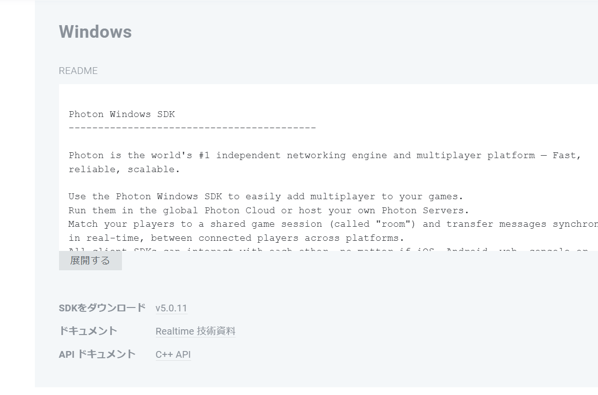

# Siv3Dでオンラインマルチプレイヤーゲームを作ろう！
Siv3Dのアドオンとして提供されている、Multiplayer_Photonを用いてオンラインマルチプレイヤーゲームを作るチュートリアルです。

### 準備

[OpenSiv3D v0.6.4 Multiplayer_Photon チュートリアル :material-open-in-new:](https://zenn.dev/reputeless/scraps/03d951dddb53ab)

上記リンクの準備1~3に従って、プロジェクトの準備をしてください。

開発環境に応じた [Photon Realtime SDK](https://www.photonengine.com/ja-jp/sdks#realtime-cpp) (7z 形式で圧縮) をダウンロードします。OpenSiv3D v0.6.4 で検証済みの SDK バージョンは v5.0.3.0 です

