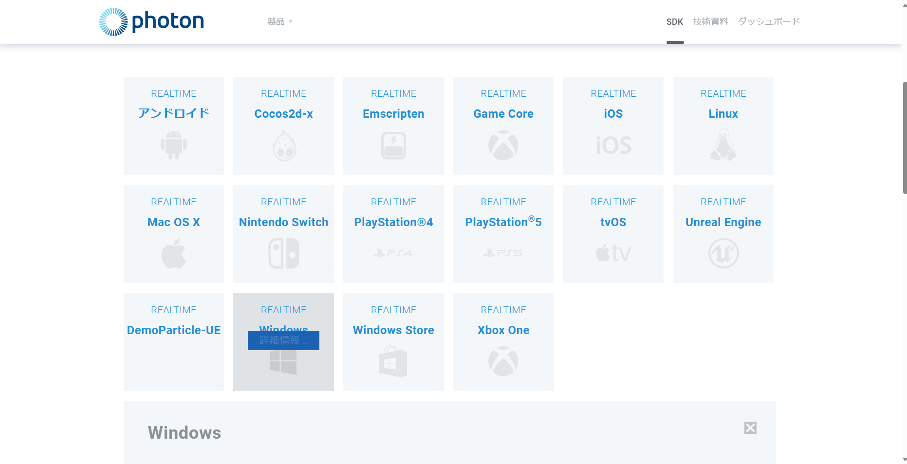
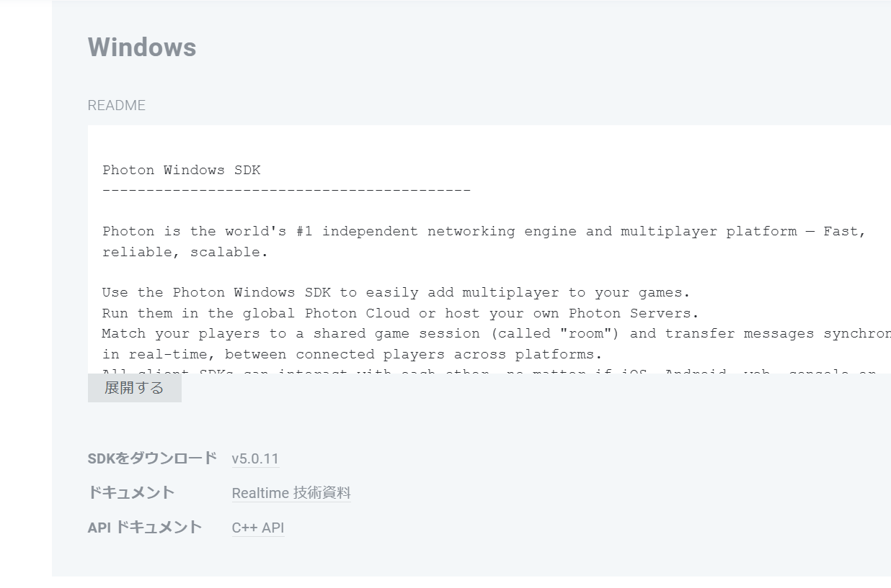
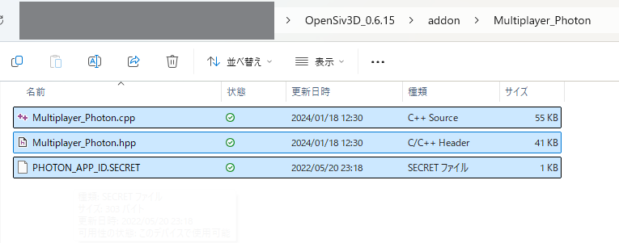
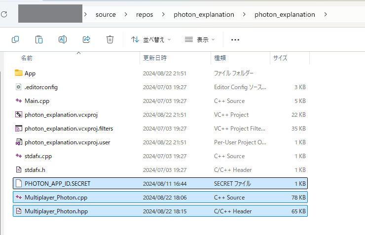
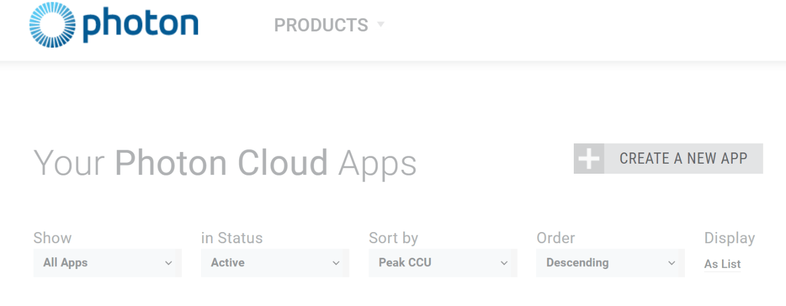
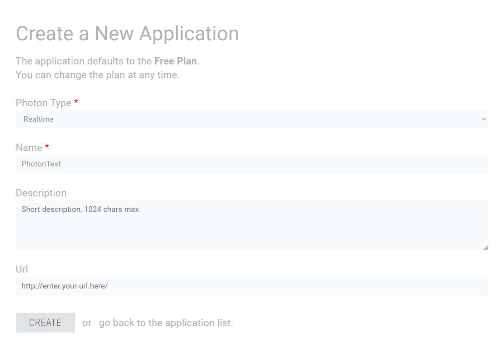

# Siv3Dでオンラインマルチプレイヤーゲームを作ろう！
Siv3Dのアドオンとして提供されている、Multiplayer_Photonを用いてオンラインマルチプレイヤーゲームを作るチュートリアルです。

## 準備 1 | Photon SDK のダウンロード

開発環境に応じた [Photon Realtime SDK:material-open-in-new:](https://www.photonengine.com/ja-jp/sdks#realtime-cpp) (7z 形式で圧縮) をダウンロードします。OpenSiv3D v0.6.15 で検証済みの SDK バージョンは `v5.0.11.0` です。

WindownsならREALTIME Windowsを選択。

SDKをダウンロードの横のリンクをクリック。

ダウンロードした7z 形式のファイルを展開し、適当な場所に配置します（これ以降の手順でプロジェクトのインクルード / ライブラリパスをこのフォルダパスに対して設定するため、これ以降は移動させないでください。）

[7zip解凍環境がない方はこちらのソフトをダウンロード:material-open-in-new:](https://www.7-zip.org/)

## 準備2 | プロジェクトの準備
1. 通常どおり Siv3D アプリケーションプロジェクト (v0.6.15) を作成します。
2. Siv3D SDK フォルダ内の `addon/Multiplayer_Photon` フォルダから 3 つのファイル `Multiplayer_Photon.hpp`, `Multiplayer_Photon.cpp`, `PHOTON_APP_ID.SECRET` をコピーして、プロジェクトの Main.cpp があるフォルダに配置します。

??? info "Siv3D SDK"
    Siv3D をインストールしたときに作成されるフォルダです。macOS の場合それ自体、Windows の場合はデフォルトでドキュメントフォルダに OpenSiv3D_0.6.* という名前で作成されます
3. Multiplayer_Photon ライブラリを自分のプロジェクトで使うために、コピーした `Multiplayer_Photon.hpp` と `Multiplayer_Photon.cpp` をプロジェクトに追加し、ビルド対象に含むようにします（ただし、このままでは Photon SDK へのインクルード・ライブラリパスが通っていないため、ビルドには失敗します）

Visual Studio の場合の参考動画
<video controls src="20240822-1303-37.8676551.mp4" title="Title"></video>

4. (Windows の場合) プロジェクトの設定で、インクルードディレクトリとライブラリディレクトリそれぞれに、ダウンロードした Photon SDK フォルダのパス (例: C:/Users/siv3d/Desktop/libs/Photon-Windows-Sdk_v5-0-3-0) を追加します
5. (macOS の場合) プロジェクトの設定で、ダウンロードした Photon SDK フォルダのパスを Build Settings の Header Search Paths に追加し、Library Search Paths に ???/Common-cpp/lib, ???/LoadBalancing-cpp/lib, ???/Photon-cpp/lib, ???/3rdparty/lib/apple の 4 つのパスを追加 (??? は Photon SDK フォルダのパス) したうえで、Build Phases の Link Binary With Libraries に、それらのフォルダの中身のうち libCommon-cpp_release_macosx.a, libLoadBalancing-cpp_release_macosx.a, libPhoton-cpp_release_macosx.a, libcrypto_release_macosx.a の 4 ファイルを追加します
6. これでビルドができればプロジェクトの準備は完了です

## 準備3 | Photon App ID を取得し、プロジェクトに設定する
Photon Web サイトログイン後、ダッシュボード画面を開きます。

ダッシュボード画面の CREATE A NEW APP を押して情報を入力し、CREATE から新しい Photon App ID を発行します。Photon Type は Realtime を選択します。それ以外の入力項目は任意です。

- 発行される Photon App ID は `"xxxxxxxx-xxxx-xxxx-xxxx-xxxxxxxxxxxx"` のような英数字の羅列です。
- プロジェクトの PHOTON_APP_ID.SECRET に書かれているデフォルトの App ID `"00000000-0000-0000-0000-000000000000"` を、発行された Photon App ID で上書きします。
- (プロジェクトを git 管理している場合) この Photon App ID は第三者に知られてはいけません。`.gitignore` を用いて、`PHOTON_APP_ID.SECRET` を管理対象から外すようにしましょう
