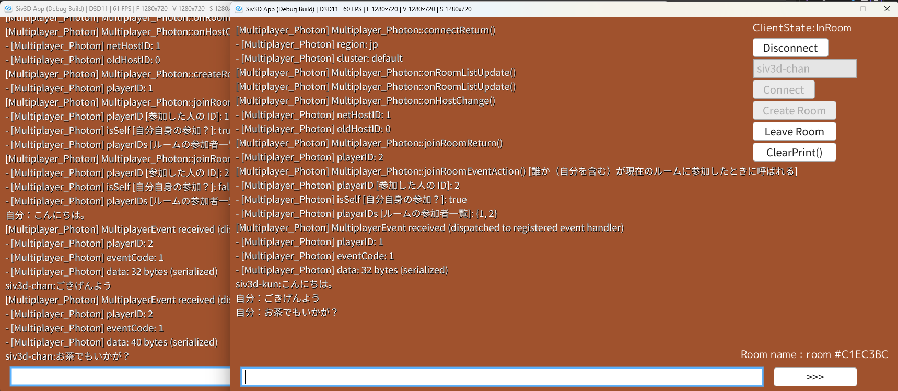

# 動かしてみよう！
## 簡単なチャットルームを作成

??? summary "サンプルコード"
    ```cpp
    # include <Siv3D.hpp> // Siv3D v0.6.15
    # include "Multiplayer_Photon.hpp"
    # include "PHOTON_APP_ID.SECRET"

    class MyClient : public Multiplayer_Photon
    {
    public:
        MyClient() {
            init(std::string(SIV3D_OBFUSCATE(PHOTON_APP_ID)), U"1.0", Verbose::Yes);

            //イベントコード1を受信したときにeventReceived_1を呼ぶように登録
            RegisterEventCallback(1, &MyClient::eventReceived_1);
        }

    private:
        void eventReceived_1(const LocalPlayerID playerID, const String& text)
        {
            Print << getUserName(playerID) << U":" << text;
        }
    };

    void Main()
    {
        Window::Resize(1280, 720);

        MyClient client;

        TextEditState playerName{ U"siv3d-kun" };

        TextEditState sendText;

        Font font(20);

        while (System::Update())
        {
            client.update();

            if (client.isInLobby()) {
                Scene::Rect().draw(Palette::Steelblue);

                //ロビー内に存在するルームを列挙
                font(U"Rooms").draw(Vec2{ 650, 5 });
                {
                    auto roomNameList = client.getRoomNameList();
                    double y = 0;
                    for (size_t i = 0; i < roomNameList.size(); ++i)
                    {
                        //クリックで入室
                        if (SimpleGUI::Button(roomNameList[i], Vec2{ 650, (y += 40) }, 330, client.isInLobby()))
                        {
                            client.joinRoom(roomNameList[i]);
                        }
                    }
                }
            }

            if (client.isInRoom()) {
                Scene::Rect().draw(Palette::Sienna);

                font(U"Room name : ", client.getCurrentRoomName()).draw(Arg::topRight(Scene::Width() - 20, Scene::Height() - 90));

                SimpleGUI::TextBox(sendText, Vec2{ 20, Scene::Height() - 50 }, 1000, unspecified, client.isInRoom());

                //ボタンを押すかエンターキーを押すと文字列を送信
                if (SimpleGUI::Button(U">>>", Vec2{ 1040, Scene::Height() - 50 }, 160, client.isInRoom()) or sendText.enterKey)
                {
                    //イベントコード1で文字列を送信
                    client.sendEvent(MultiplayerEvent(1), sendText.text);
                    Print << U"自分：" << sendText.text;
                    sendText.clear();
                    sendText.active = true;
                }
            }

            //クライアントは7つの状態を持つ
            font(U"ClientState:", client.getClientState()).draw(1000, 5);

            if (client.isConnectingToLobby() or client.isJoiningRoom() or client.isLeavingRoom() or client.isDisconnecting()) {
                //待機画面のクルクル
                size_t t = Floor(fmod(Scene::Time() / 0.1, 8));
                for (size_t i : step(8)) {
                    Vec2 n = Circular(1, i * Math::TwoPi / 8);
                    Line(Scene::Center() + n * 10, Arg::direction(n * 10)).draw(LineStyle::RoundCap, 4, t == i ? ColorF(1, 0.9) : ColorF(1, 0.5));
                }
            }

            //コントロールパネル

            double y = 0;
            if (SimpleGUI::Button(U"Disconnect", Vec2(1000, y += 40), unspecified, client.isActive()))
            {
                client.disconnect();
            }

            SimpleGUI::TextBox(playerName, Vec2(1000, y += 40), 200, unspecified, client.isDisconnected());

            if (SimpleGUI::Button(U"Connect", Vec2(1000, y += 40), unspecified, client.isDisconnected()))
            {
                //名前、リージョンを指定して接続
                client.connect(playerName.text, U"jp");
            }

            if (SimpleGUI::Button(U"Create Room", Vec2{ 1000, (y += 40) }, 160, client.isInLobby()))
            {
                //部屋名は被ってはいけないのでランダムな文字列を付加
                const RoomName roomName = (U"room #" + ToHex(RandomUint32()));

                //ロビー内に部屋を作成
                client.createRoom(roomName);
            }

            if (SimpleGUI::Button(U"Leave Room", Vec2{ 1000, (y += 40) }, 160, client.isInRoom()))
            {
                client.leaveRoom();
            }

            if (SimpleGUI::Button(U"ClearPrint()", Vec2{ 1000, (y += 40) }, 160))
            {
                ClearPrint();
            }

        }
    }

    ```

上記サンプルコードを貼り付け、実行してみましょう。`Connect`を押し、少しまって画面が青くなったら接続成功です。その後`Create Room`を押すと部屋を作成と同時に入室でき、画面が茶色くなったら部屋にいる状態です。画面下のテキストボックスからチャットを打てますが、今は一人しかいないため意味はないです。

### 一人で通信を確認する

プロジェクトのAppフォルダを開きます。先ほど作った実行ファイル（.exeファイル）を複数回ダブルクリックして起動すれば、一台のパソコンで通信が行えているのを確認できます。

一人目が部屋を作成したら、二人目はRoomsの下に部屋の名前で入室ボタンが表示されるはずなので、そこから同じ部屋に入れます。チャットを送りあえることを確認しましょう。

