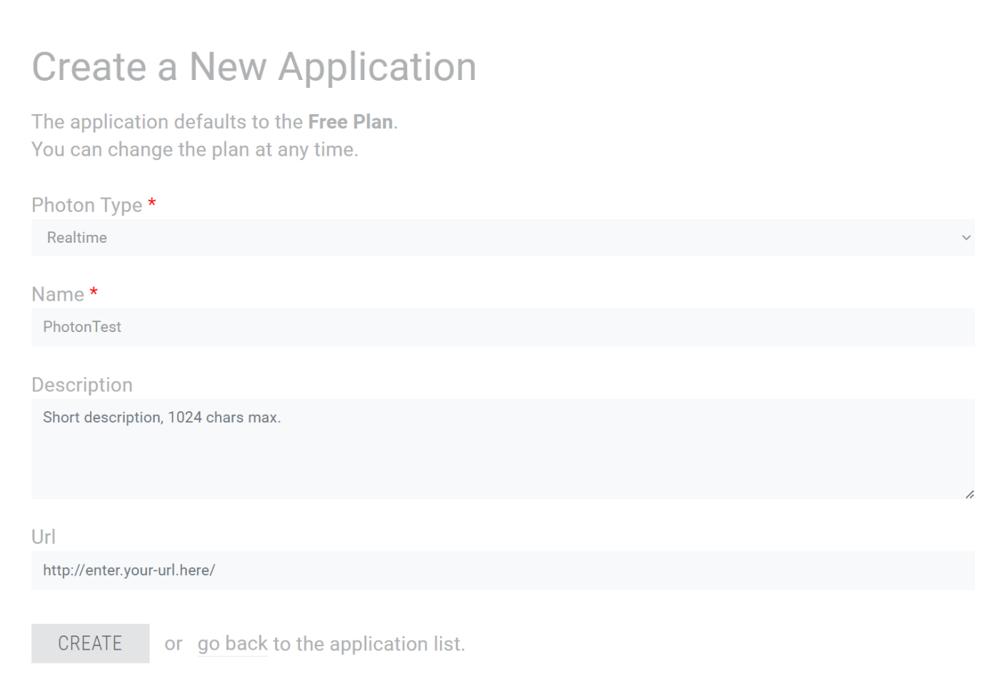

# Siv3D for Webでオンラインマルチプレイヤーゲームを作ろう！
Siv3D for Web上で、Multiplayer_Photonを用いてオンラインマルチプレイヤーゲームを作るチュートリアルです。

通常の手順は[Siv3Dでオンラインマルチプレイヤーゲームを作ろう！](index.md)を参照してください。


## 準備 1 | Photon SDK のダウンロード

[Photon Realtime SDK:material-open-in-new:](https://www.photonengine.com/ja-jp/sdks#realtime-javascript-sdkrealtimejavascript)の JavaScript 版（zip形式で圧縮）をダウンロードします。OpenSiv3D v0.6.15 で検証済みの SDK バージョンは `v4.2.0.0` です。

ダウンロードした zip 形式のファイルを展開し、適当な場所に配置します。

## 準備2 | プロジェクトの準備

1. Siv3D for Webのプロジェクトを作成します。詳しい手順は[OpenSiv3D for Web:material-open-in-new:](https://siv3d.github.io/ja-jp/download/web/)を参照してください。

2. Siv3D SDK フォルダ内の `addon/Multiplayer_Photon` フォルダから 4 つのファイル `Multiplayer_Photon.hpp`, `Multiplayer_Photon.cpp`, `Multiplayer_Photon.js`, `PHOTON_APP_ID.SECRET` をコピーして、プロジェクトの Main.cpp があるフォルダに配置します。

3. `Multiplayer_Photon.cpp`をビルド対象に含むように設定し、リンカオプションに`--js-library MultiplayerPhoton.js`, `-pre-js ???/lib/photon.js`を指定します（??? は Photon SDK フォルダのパス）。

    ??? "Visual Studio の場合"
        プロジェクトのプロパティを開き、`Emscripten リンカ/入力`のページ内に移動し、Pre-Add Javascript Fileに`???/lib/photon.js`を追加し、追加の JavaScript ライブラリに`$(ProjectDir)/MultiplayerPhoton.js`を追加します。

    ??? "Visual Studio Code の場合"
        `Link.rsp`ファイルに`--js-library MultiplayerPhoton.js` `--pre-js ???/lib/photon.js`を追加します。

4. これでビルドができればプロジェクトの準備は完了です

??? 起動時にエラーが出る場合
    起動直後に上部のステータスバーが赤色に変化し、ブラウザのコンソールに以下のようなエラーが表示されることがあります。
    Emscriptenのリンカオプションに`-s ASYNCIFY_STACK_SIZE=24576`のように設定し、スタックサイズを増加させると解決する場合があります。
    ```
    Uncaught RuntimeError: Aborted(RuntimeError: unreachable)
        at abort (index.js:6280:11)
        at runAndAbortIfError (index.js:14851:9)
        at Object.maybeStopUnwind (index.js:14954:11)
        at ret.<computed> (index.js:14932:30)
        at index.js:6326:22
        at callMain (index.js:20385:15)
        at doRun (index.js:20440:23)
        at index.js:20451:7
    ```

## 準備3 | Photon App ID を取得し、プロジェクトに設定する
Photon Web サイトログイン後、ダッシュボード画面を開きます。


ダッシュボード画面の CREATE A NEW APP を押して情報を入力し、CREATE から新しい Photon App ID を発行します。Photon Type は Realtime を選択します。それ以外の入力項目は任意です。



- 発行される Photon App ID は `"xxxxxxxx-xxxx-xxxx-xxxx-xxxxxxxxxxxx"` のような英数字の羅列です。
- プロジェクトの PHOTON_APP_ID.SECRET に書かれているデフォルトの App ID `"00000000-0000-0000-0000-000000000000"` を、発行された Photon App ID で上書きします。
- (プロジェクトを git 管理している場合) この Photon App ID は第三者に知られてはいけません。`.gitignore` を用いて、`PHOTON_APP_ID.SECRET` を管理対象から外すようにしましょう
